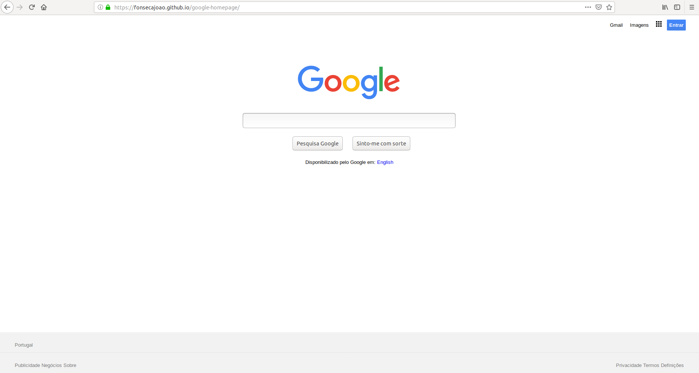

# Google Homepage Project

## What is Google Homepage Project

For this mini-project, I'll deconstruct an existing Google's homepage and rebuild it. Not everything is working a.k.a search function. The goal is to start thinking about how elements get placed on the page and roughly how they get styled and aligned. This project is part of the Microverse Pre-course and The Odin Project.

### What skills or tools I've used

* Simple image editor program and Developer Tools to descontruct the homepage

* HTML/CSS 

* Git/Github

* Search skills for whenever i got stuck

### Screenshot

